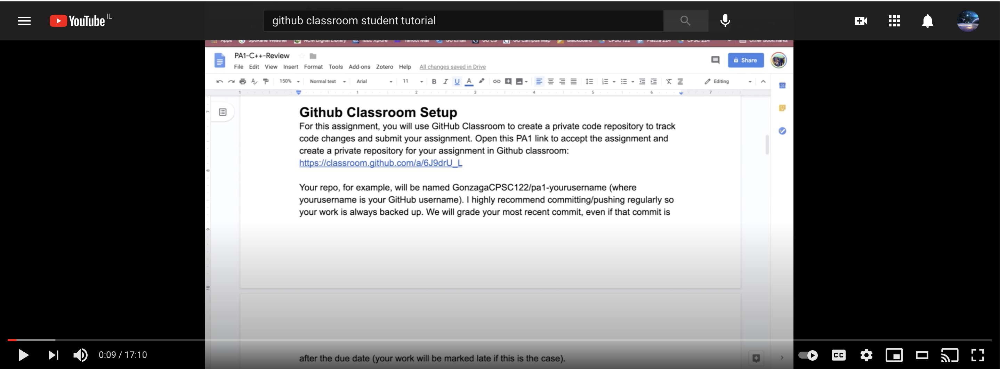

# GitHub Classroom  

In this course, you will use GitHub Classroom for sharing code. The two primary ways you will use GitHub classroom for sharing code are for (1) completing interview-style coding exercises, and (2) submitting individual and team assignments. 

Before reading this document, you should first read the document about using the command line. It will help you get started with GitHub Classroom.

Once you start reading this article, be sure to read to the end because you'll find helpful videos that show someone working with GitHub classroom in the ways described in this document and in the ways you'll want to for this course. 

After reading this document, you will know:  

- [What GitHub Classroom is](#what-is-github-classroom)  
- [Why Use GitHub Classroom](#why-use-github-classroom) 
- [How To Create A Classroom Repository](#how-to-create-a-classroom-repository)  
- [How To Download Your Classroom Repository](#how-to-download-your-classroom-repository)  
- [How To Modify Your Code](#how-to-modify-your-code)  
- [How To Push Your Code To Your Classroom Repository](#how-to-push-your-code-to-your-classroom-repository)  


## [What Is GitHub Classroom](#what-is-github-classroom)  

GitHub Classroom is an online education tool for developers that allows students and staff to share code, exchange lecture materials, and otherwise communicate about learning how to code. For instance, using GitHub Classroom, ITC can create assignments with or without starter code, share code, instructions and lecture materials with you, track your work, review your code, provide feedback on your work, and more. 

GitHub Classroom has all the tools that professional developers use to store and share code on GitHub. At its core, GitHub is an online version control system. It has many features that professional developers need for saving and managing their code. For instsance, GitHub lets you save your code online as you develop, which helps keep you from losing your work if something happens to your computer. With GitHub, you also can revert back to older drafts, create branches so that you can build and perfect features before adding them to the main project, review and comment on your co-worker's code, and much more. 

GitHub Classroom has the same tools as GitHub, plus it has built-in workflows designed to enhance interactions between students and staff. For instance, ITC can create a coding template for each exercise a student must complete, and GitHub Classroom will use it to create a GitHub Classroom repository for each student based on that coding template. Then, each student can submit their work for that exercise to their repository. 

What is a repository?!

A GitHub repository is a supercharged interactive online storage space for your code. In a GitHub repository, you store all the code for a project online. Plus, you can store and access the revision history of each file, discuss and manage your project with teammates, and almost anything else you can think of for storing and managing your code online. 

One of the Classroom features in each student repository is the **Feedback** feature. For each assignment, after a student submits their work, a staff member can review it and provide in-line feedback in the **Feedback** pull request that Classroom automatically generates. The student can review the in-line feedback and then mark it as complete so that the staff knows.

## [Why Use GitHub Classroom](#why-use-github-classroom)     

At ITC, we use GitHub Classroom for several reasons. We use it mainly to:  

- Prepare you to **become a professional** developer  
- **Share code** between and among students and ITC    
- Track **your progress**  
- **Review code** and offer feedback  

First, GitHub is the most popular version controlling system for developers. By using GitHub Classroom, you learn many of the Github tools you'll need for working as a developer. Later in this course, you'll learn more about GitHub generally, which will build upon what you learn about using GitHub Classroom.

Second, using GitHub Classroom, we can share code with you and you can share code with us. For instance, throughout the course, you will have to complete many interview-style coding exercises. For each interview exercise, we give you code that tests the code you write. We share that testing code with you through GitHub Classroom. You submit your code for each exercise to us through GitHub Classroom.

Throughout the course, you also will have assignments that require you to build a frontend, backend, or fullstack web application by completing certain milestones. For those, you also will submit your work to ITC through GitHub Classroom.  

Third, GitHub Classroom lets us easily keep track of your work. For each exercise and assignment, GitHub Classroom generates a repository for each student to store their work. ITC staff can see your repositories and know when and whether you've submitted code. This can help us identify students who are falling behing or speeding ahead!

Fourth, GitHub Classroom makes it easy for us to review your code and provide feedback. For instance, for your individual assignments, we use GitHub Classroom's **Feedback** pull request to comment on your code. You can review our comments right there in the **Feedback** pull request in your GitHub Classroom repository. Be sure to implement the feedback and mark the feedback as completed. You should practice using these tools during the course. It will help you practice using GitHub pull requests, comments, and other communication tools for building team projects.    

## [How To Create A Classroom Repository](#how-to-create-a-classroom-repository) 

ITC staff will share with you a link to a GitHub Classroom each time you need to create a new GitHub Classroom repository. ITC staff will share the links through the **Google** Classroom. The link looks something like this:  

```
https://classroom.github.com/a/rhZAXqkk
```

After you click on the link, the browser should redirect you to GitHub Classroom. You should see a page that looks like this:  

  

After you click on the link to your new repository, it should redirect you to your new repository. Sometimes the repository will come with folders and files and other times it might be empty. Regardless, here is an example of a repository that comes with folders and files:    

  

Great! Now you've successfully created a GitHub Classroom repository. The next step is to download it to your computer so that you can write code.

## [How To Download Your Classroom Repository](#how-to-download-your-classroom-repository)  

First, you need to install `git` on your computer. To install `git`, you first should know what the terminal is. The terminal is software that lets you interact with your computer without a graphical user interface. You can use the terminal to install software, check the versions of installed software, and much more. When using the terminal, you will write short instructions that tell your computer what to do.

When installing `git` on your computer, you will need to use the terminal. To access the terminal, search your Windows computer for "Command Prompt" or your Mac for "Terminal". Once open, it will be pointing to your Desktop.

Now that you know what the terminal is and how to access it, you can install `git`. Follow these [instructions for installing `git`](https://www.atlassian.com/git/tutorials/install-git).  

With `git` installed, you now can pull the code from your GitHub repository to your computer. If you haven't already, create a folder on your Desktop for your work at ITC. Call it whatever you want, like "itc_bootcamp_day_one". We recommend you use a short but descriptive folder name.   

In your terminal, type `cd` and then spacebar, and then drag your new folder to the terminal. When you let go of the mouse, you should see the file path for your new folder. Hit enter in the terminal. Now the terminal is inside your new folder.  

With the terminal in your new project folder, you can now clone the code from your GitHub repository into your new folder. In your GitHub repository, click on the green button that says "Code" and copy the `https` address.  

  

Now, back in the terminal, type `git clone`, then spacebar, and then paste the `https` address. It'll look something like this:

```terminal
git clone https://github.com/israeltechchallenge/js-week01-d01-yourname.git
```

Then hit enter. You should see a message in your terminal that indicates success, and looks something like this:  

  

Also, open up your new folder. You should see the files and folders from the GitHub repository inside your new folder!  

You now should enter `ls` in the command line. You should see the GitHub repository that you cloned. Next, **you need to change directories** into your new folder. To do so, enter in the command line `cd < the_name_of_your_repo>`. Then, enter `ls` again in the command line, and you shoud see the contents of your folder.

## [How To Modify Your Code](#how-to-modify-your-code)  

Open your new folder in VS Code. You can modify the folders and files that you downloaded from your GitHub repository. However, for the daily exercises, the only files you should modify are the index.js files in the EX folders. The other folders and files are for testing your code and tracking your repository. 

After you write your code and run the tests, you should save your work in VS Code with File --> Save. 

## [How To Push Your Code To Your Classroom Repository](#how-to-push-your-code-to-your-classroom-repository)  

When you are done with your work, you should push it from your new folder to the GitHub repository. How you do that depends upon whether your Classroom repository came to you with or without starter code. For your JavaScript exercises, you will receive starter code. For your assignments, you will receive empty repositories. Accordingly, you should know both ways. 

Here is a walk through of how to get started with a Classroom repository **that comes with starter code**. This will help you with the JavaScript exercises. You can probably do the same approach for repositories that come without starter code. However, below is a video for each scenario that walks you through the steps for both.

In VS Code, open the terminal by going to "View" and choosing "Terminal". A terminal session should open in VS Code. Make your pwd the repository folder you downloaded from the Classroom. Make sure the terminal is pointing to your root level of your new repository folder. To be sure, type `ls -al`. You should see a `.git` file in the terminal print out. That is your local git tracking folder that came with your Classroom repository.

Next, enter the following in the terminal

```terminal
git add -A
```
Next, enter the following in the terminal:

```terminal
git commit -m "submitting tests"
```

Then, enter in the terminal the command `git push`. You should see a success message in the terminal.

If you refresh your GitHub repository, you should see it updated with the changes you made!  

To watch someone work with a GitHub Classroom repository that comes **with** starter code, [watch this video](https://www.youtube.com/watch?v=10krMetDSWs).  

If you have trouble, make sure you have git initiated. If you did `git pull` instead of `git clone` to copy the GitHub repo to your machine, you may need to do inside your downloaded repo a few commands. First, check if git is initiated. Type `ls -al` in the terminal pointed at your repo folder on your computer. If you don't see a `.git` folder, then you should do the following steps in the command line: `git init`, then the `git pull https://github.com/israeltechchallenge/js-week01-d01-yourname.git master`, make your changes, `git add -A`, `git commit -m "your message"`, and then `git push --set-upstream https://github.com/israeltechchallenge/js-week01-d01-yourname.git master`.

[](https://www.youtube.com/watch?v=10krMetDSWs)

The steps for working with a repository that comes without starter code are similar but some differences exist that you should know of. Those differences revolve around how you pull the code from GitHub to your machine and then connect your local copy of the project to the GitHub repository. To watch someone work with a GitHub Classroom repository that comes **without** starter code, [watch this video](https://www.youtube.com/watch?v=jXpT8eOzzCM).  

[](https://www.youtube.com/watch?v=jXpT8eOzzCM)

In the coming lessons, you see written materials that will help you when working without starter code.
