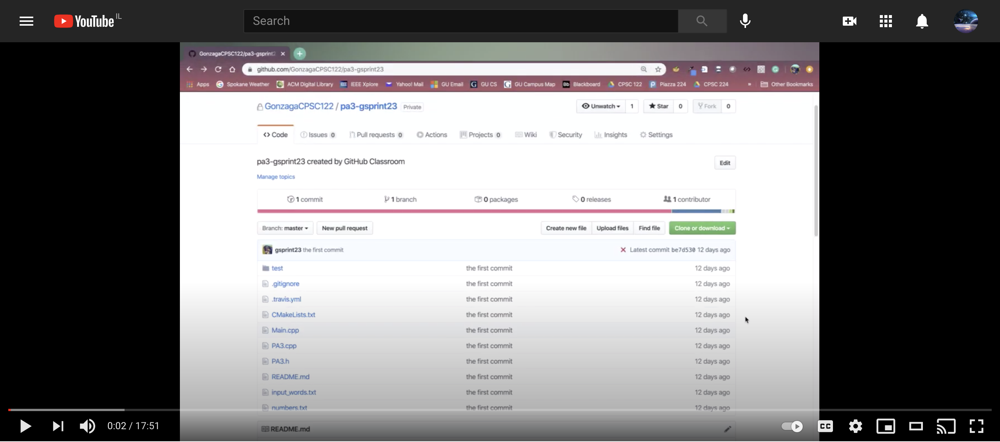

# Intro To GitHub

## [Fixing Common Error Of Unrelated Histories](#fixing-common-error-of-unrelated-histories)

When trying to push code to GitHub, it is common to get the following error: 

```terminal
fatal: refusing to merge unrelated histories.
```

It can be difficult to solve this, espcially when you're mentally focused on your code and engineering instead of your command-line, `git`, and GitHub skills. Don't worry. You can fix it. The following video should help:  

[](https://www.youtube.com/watch?v=ZcnuuP32SY4)
